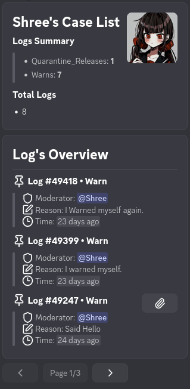
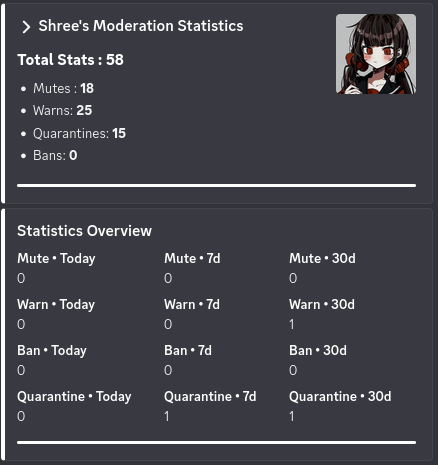
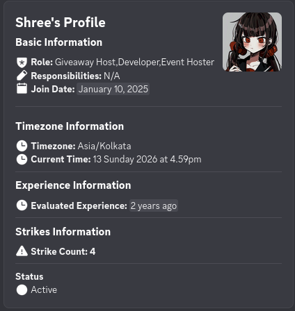
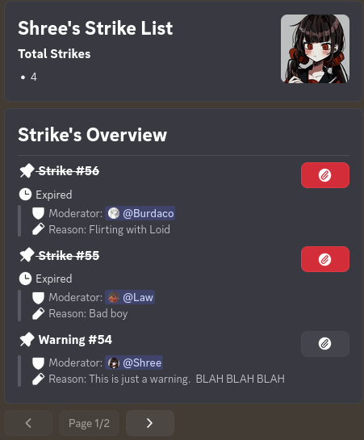
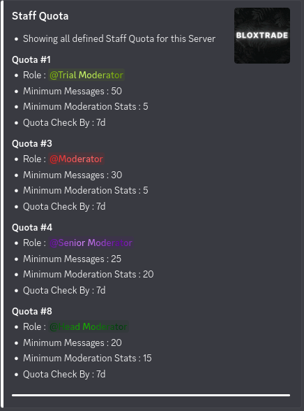
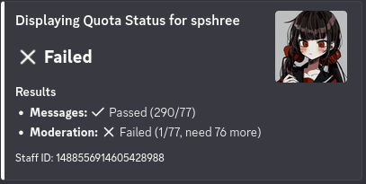
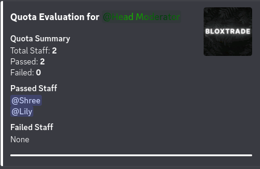

  
  <h1 style="margin: 0;">Lily V2</h1>

Multi-purpose Discord bot designed to do almost any stuffs

> [!WARNING]
> Setting up this bot on your own currently requires some manual configuration. I'm working on improving the configuration system to make the setup process easier.

[Contact me on Discord](https://discord.com/users/1488556914605428988) if you have any doubts about this project or want to set this up on your own.

---

## MODULES

Modules are the **core features** of the bot. Each module consists of different features of the bot that are used generally or specifically depending on the use case.

All modules are based on **Cogs**, meaning they can be removed or placed depending on the use case.

---

## LIST OF AVAILABLE MODULES

- **Lily Application**: Focused on handling form Applications
- **Lily Moderation**: focused on moderation
- **Lily Management**: focused on staff management
- **Lily Logging**: focused on error logging and debugging
- **Lily Utility**: focused on general purpose utilities
- **Lily Ticketing Tool**: focused on ticket system
- **Lily Leveling | Economy System**: focused on gaining levels / currency (currently reworking)

---

## LIST OF AVAILABLE GAME SUPPORT

- **Lily Blox Fruits**: A module dedicated for one of the most famous Roblox games, "Blox Fruits"

---

## MAIN TECH STACK USED

- discord.py
- requests
- pillow
- rapidfuzz
- asqlite

---

# BOT PREVIEW

## BLOX FRUITS Modules (Images)

|  |  |
| :------------------------------: | :------------------------------------------: |
|         **Stock System**         |               **Fruit Values**               |

|  |  |
| :----------------------------------: | :-------------------------------------------------: |
|            **Win / Loss**            |                 **Fruit Suggestor**                 |

---

## MODERATION TOOLS

|  |  |
| :-------------------------------------: | :-----------------------------------: |
|              **Mod Logs**               |             **Mod Stats**             |

|  |
| :-------------------------------------: |
|           **Proof Retrieval**           |

## STAFF MANAGEMENT TOOLS

|  |  |
| :---------------------------------------: | :------------------------------------: |
|             **Staff Profile**             |             **Staff List**             |

|  |
| :---------------------------------: |
|        **Staff Infractions**        |

### Quota System

|  |  |
| :------------------------------------: | :------------------------------------------: |
|            **Staff Quota**             |               **Quota Check**                |

|  |
| :-------------------------------------------------: |
|            **Quota Overall Evaluation**             |

---

## TICKETING TOOLS

## LEVELING / ECONOMY MODULE

|  |  |
| :-------------------------------------: | :----------------------------------------: |
|              **Leveling**               |                **Profile**                 |

  
**Leaderboard**

---

## GREETING MODULE: WELCOME AND GOODBYE

---

## QUOTES

---

## SUPPORT

Feel free to contact me personally through my Discord **[spshree]** if you want more games to be added to the bot.
